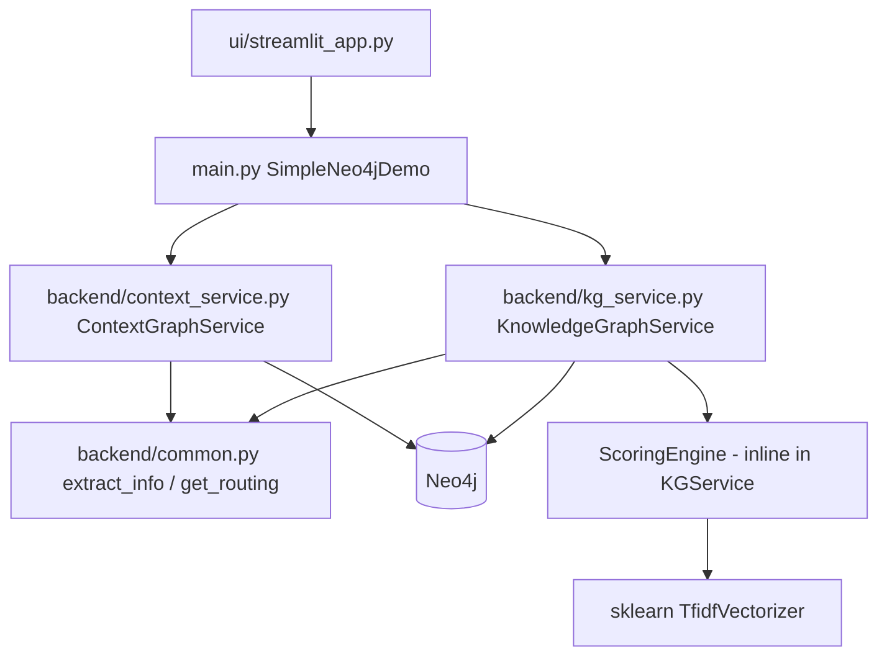
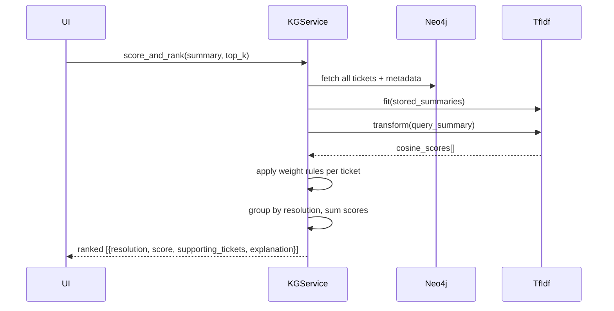

# Design: Printer Context Graph POC

## Overview

This design refactors the existing Neo4j ticket context graph demo to use a richer, domain-specific schema tailored to Salesforce/Jira printer-support tickets. The key changes are:

1. **Richer KG schema** — replaces generic `Action/Object/Problem` nodes with typed `IssueType`, `SalesforceObject`, and `Resolution` nodes alongside a new `RESOLVED_BY` relationship and statistical similarity edges.
2. **Richer Context Graph schema** — replaces `ContextAction/ContextObject/ContextProblem` with `ContextIssueType`, `ContextSalesforceObject`, and `ContextResolution`.
3. **Rewritten entity extractor** — `extract_info()` now returns `{action, object, issue_type, resolution}` using expanded Salesforce/Jira keyword rules.
4. **Hardcoded 10-ticket dataset** — replaces CSV loading with an in-code dataset so the demo is self-contained.
5. **Scoring engine** — replaces the simple exact-match query with a weighted TF-IDF + graph-match scorer that returns ranked resolutions.
6. **Updated stats keys** — both KG and context graph stats dicts gain `issue_type_count` and `resolution_count`; `problem_count` is removed.
7. **Streamlit label updates** — metric labels updated to match new stat keys; no structural UI changes.

---

## Architecture



### Change summary per file

| File | Change |
|---|---|
| `backend/common.py` | Rewrite `extract_info()` return shape; expand keyword rules; update `get_routing()` |
| `backend/kg_service.py` | New schema, hardcoded dataset, scoring engine, updated stats |
| `backend/context_service.py` | New context node/relationship types, updated stats keys |
| `main.py` | Thin facade — no logic changes, just pass-through updates for new method signatures |
| `ui/streamlit_app.py` | Metric label updates only |

---

## Components and Interfaces

### `backend/common.py`

```python
def extract_info(summary: str) -> Dict:
    """
    Returns:
        {
          "action":     str | None,   # DELETE, ACCESS, CREATE, UPDATE, MERGE, REASSIGN
          "object":     str | None,   # Opportunity, Account, Case, Lead, Contact, ...
          "issue_type": str | None,   # Duplicate, Permission, DataQuality, Integration, ...
          "resolution": str | None,   # MergeRecords, GrantAccess, DeleteRecord, ...
        }
    """

def get_routing(info: Dict) -> str:
    """
    Uses info["issue_type"] and info["resolution"] (not "problem") to suggest a team.
    """
```

### `backend/kg_service.py`

```python
class KnowledgeGraphService:
    HARDCODED_TICKETS: List[Dict]  # 10 tickets, class-level constant

    def ensure_kg_schema(self)           # creates constraints
    def load_hardcoded_tickets(self)     # replaces load_sample_tickets CSV path
    def add_ticket(self, ticket_id, summary, resolution=None)
    def create_similarity_links(self)    # SIMILAR_TO on shared IssueType+Object
    def score_and_rank(self, summary, top_k=3) -> List[Dict]  # scoring engine
    def get_graph_stats(self) -> Dict    # 6 keys
```

### `backend/context_service.py`

```python
class ContextGraphService:
    def ensure_context_graph_schema(self)
    def create_context_graph_from_summary(self, ...) -> Dict
    def get_context_graph_stats(self) -> Dict   # 6 keys
```

### Scoring Engine (inline in `KnowledgeGraphService`)

```python
def score_and_rank(self, summary: str, top_k: int = 3) -> List[Dict]:
    """
    Returns list of:
    {
      "resolution":        str,
      "score":             float,
      "supporting_tickets": List[str],
      "explanation":       str,
    }
    sorted descending by score.
    """
```

---

## Data Models

### Knowledge Graph Schema

#### Nodes

| Label | Key property | Description |
|---|---|---|
| `Ticket` | `id` | A support ticket |
| `IssueType` | `name` | Classified issue category (e.g. `Duplicate`, `Permission`) |
| `SalesforceObject` | `name` | Salesforce entity (e.g. `Opportunity`, `Account`) |
| `Action` | `name` | Verb extracted from summary (e.g. `DELETE`, `ACCESS`) |
| `Resolution` | `name` | How the ticket was resolved (e.g. `MergeRecords`, `GrantAccess`) |

#### Relationships

| Relationship | From → To | Description |
|---|---|---|
| `HAS_ISSUE_TYPE` | Ticket → IssueType | Ticket is classified under this issue type |
| `INVOLVES_OBJECT` | Ticket → SalesforceObject | Ticket involves this Salesforce object |
| `HAS_ACTION` | Ticket → Action | Verb extracted from ticket summary |
| `RESOLVED_BY` | Ticket → Resolution | How this ticket was resolved |
| `TYPICALLY_INVOLVES` | IssueType → SalesforceObject | Statistical edge: this issue type commonly involves this object |
| `TYPICALLY_RESOLVES_WITH` | IssueType → Resolution | Statistical edge: this issue type commonly resolves this way |
| `SIMILAR_TO` | Ticket → Ticket | Tickets sharing IssueType + SalesforceObject |

#### Cypher Schema Constraints

```cypher
CREATE CONSTRAINT ticket_id IF NOT EXISTS
  FOR (t:Ticket) REQUIRE t.id IS UNIQUE;

CREATE CONSTRAINT issue_type_name IF NOT EXISTS
  FOR (i:IssueType) REQUIRE i.name IS UNIQUE;

CREATE CONSTRAINT salesforce_object_name IF NOT EXISTS
  FOR (o:SalesforceObject) REQUIRE o.name IS UNIQUE;

CREATE CONSTRAINT action_name IF NOT EXISTS
  FOR (a:Action) REQUIRE a.name IS UNIQUE;

CREATE CONSTRAINT resolution_name IF NOT EXISTS
  FOR (r:Resolution) REQUIRE r.name IS UNIQUE;
```

### Context Graph Schema

#### Nodes

| Label | Key property | Description |
|---|---|---|
| `ContextDocument` | `id` | Top-level document (PDF or manual) |
| `ContextPage` | `id` | A page within a document |
| `ContextChunk` | `id` | A text chunk within a page |
| `ContextIssueType` | `name` | Issue type mentioned in a chunk |
| `ContextSalesforceObject` | `name` | Salesforce object mentioned in a chunk |
| `ContextResolution` | `name` | Resolution mentioned in a chunk |

#### Relationships

| Relationship | From → To |
|---|---|
| `HAS_PAGE` | ContextDocument → ContextPage |
| `HAS_CHUNK` | ContextPage → ContextChunk |
| `MENTIONS_ISSUE_TYPE` | ContextChunk → ContextIssueType |
| `MENTIONS_OBJECT` | ContextChunk → ContextSalesforceObject |
| `MENTIONS_RESOLUTION` | ContextChunk → ContextResolution |

#### Cypher Schema Constraints

```cypher
CREATE CONSTRAINT ctx_document_id IF NOT EXISTS
  FOR (d:ContextDocument) REQUIRE d.id IS UNIQUE;

CREATE CONSTRAINT ctx_page_id IF NOT EXISTS
  FOR (p:ContextPage) REQUIRE p.id IS UNIQUE;

CREATE CONSTRAINT ctx_chunk_id IF NOT EXISTS
  FOR (c:ContextChunk) REQUIRE c.id IS UNIQUE;

CREATE CONSTRAINT ctx_issue_type_name IF NOT EXISTS
  FOR (i:ContextIssueType) REQUIRE i.name IS UNIQUE;

CREATE CONSTRAINT ctx_object_name IF NOT EXISTS
  FOR (o:ContextSalesforceObject) REQUIRE o.name IS UNIQUE;

CREATE CONSTRAINT ctx_resolution_name IF NOT EXISTS
  FOR (r:ContextResolution) REQUIRE r.name IS UNIQUE;
```

---

### Entity Extraction Rewrite (`backend/common.py`)

#### `extract_info()` keyword rules

```
action keywords (priority order):
  DELETE / REMOVE          → "DELETE"
  MERGE / DEDUPLICATE      → "MERGE"
  ACCESS / PERMISSION      → "ACCESS"
  REASSIGN / TRANSFER      → "REASSIGN"
  CREATE / ADD             → "CREATE"
  UPDATE / EDIT / MOVE     → "UPDATE"

object keywords:
  OPPORTUNITY / OPP        → "Opportunity"
  ACCOUNT                  → "Account"
  CASE                     → "Case"
  LEAD                     → "Lead"
  CONTACT                  → "Contact"
  ONBOARDING               → "Onboarding"
  REPORT                   → "Report"

issue_type keywords:
  DUPLICATE                → "Duplicate"
  PERMISSION / ACCESS      → "Permission"
  DATA QUALITY / CORRUPT   → "DataQuality"
  INTEGRATION / SYNC       → "Integration"
  MISSING / NOT FOUND      → "MissingData"

resolution keywords:
  MERGE / MERGED           → "MergeRecords"
  GRANT / GRANTED          → "GrantAccess"
  DELETE / DELETED         → "DeleteRecord"
  REASSIGN / REASSIGNED    → "ReassignRecord"
  SYNC / SYNCED            → "TriggerSync"
  ESCALAT                  → "Escalate"
```

#### `get_routing()` updated logic

```python
def get_routing(info: Dict) -> str:
    if info["issue_type"] == "Duplicate":
        return "Data Quality Team"
    if info["issue_type"] == "Permission":
        return "Salesforce Admin Team"
    if info["issue_type"] == "Integration":
        return "Integration Team"
    if info["action"] in ("DELETE", "MERGE"):
        return "Data Operations Team"
    if info["action"] == "CREATE":
        return "Data Operations Team"
    return "General Support Queue"
```

---

### Hardcoded 10-Ticket Dataset

Stored as `KnowledgeGraphService.HARDCODED_TICKETS` — a list of dicts with keys `id`, `summary`, `resolution`.

```python
HARDCODED_TICKETS = [
    {"id": "DEMO-001", "summary": "Delete duplicate opportunity record for ACME account",         "resolution": "MergeRecords"},
    {"id": "DEMO-002", "summary": "Need Salesforce access to update opportunity records",          "resolution": "GrantAccess"},
    {"id": "DEMO-003", "summary": "Create new onboarding record for ABC Company",                  "resolution": "CreateRecord"},
    {"id": "DEMO-004", "summary": "Merge duplicate account entries for GlobalTech",                "resolution": "MergeRecords"},
    {"id": "DEMO-005", "summary": "Permission denied when accessing lead pipeline report",         "resolution": "GrantAccess"},
    {"id": "DEMO-006", "summary": "Remove stale contact records from Q2 campaign list",           "resolution": "DeleteRecord"},
    {"id": "DEMO-007", "summary": "Reassign opportunity to new account manager after departure",  "resolution": "ReassignRecord"},
    {"id": "DEMO-008", "summary": "Salesforce and Jira integration not syncing case status",      "resolution": "TriggerSync"},
    {"id": "DEMO-009", "summary": "Duplicate lead records created during import from CSV",        "resolution": "MergeRecords"},
    {"id": "DEMO-010", "summary": "Update account billing address after company relocation",      "resolution": "UpdateRecord"},
]
```

---

### Scoring Engine Design

The scoring engine lives in `KnowledgeGraphService.score_and_rank()`.

#### Algorithm

1. **Load all stored tickets** from Neo4j with their `summary`, `issue_type`, `object`, `action`, and `resolution`.
2. **Extract info** from the incoming query summary using `extract_info()`.
3. **TF-IDF similarity**: fit a `TfidfVectorizer` over stored summaries, transform the query, compute cosine similarity, take top-3 by score.
4. **Weighted scoring** per stored ticket:

| Signal | Points |
|---|---|
| `issue_type` matches query's `issue_type` | +4 |
| `object` matches query's `object` | +3 |
| `action` matches query's `action` | +3 |
| Ticket is in TF-IDF top-3 | +5 |
| Ticket's `resolution` appears ≥2 times across all stored tickets | +2 |

5. **Group by resolution**: sum scores across all tickets sharing the same resolution.
6. **Return** top-`k` resolutions sorted descending by total score, each with:
   - `resolution`: the resolution name
   - `score`: total weighted score
   - `supporting_tickets`: list of ticket IDs that contributed
   - `explanation`: human-readable string summarising which signals fired

#### Mermaid sequence



---

### Stats Keys

#### `get_graph_stats()` — KnowledgeGraphService

```python
{
    "ticket_count":      int,
    "issue_type_count":  int,
    "object_count":      int,
    "action_count":      int,
    "resolution_count":  int,
    "similarity_count":  int,
}
```

#### `get_context_graph_stats()` — ContextGraphService

```python
{
    "document_count":   int,
    "page_count":       int,
    "chunk_count":      int,
    "issue_type_count": int,
    "object_count":     int,
    "resolution_count": int,
}
```

---

### Streamlit UI Changes (`ui/streamlit_app.py`)

`render_stats()` — update metric labels only:

```python
def render_stats(stats):
    col1, col2, col3 = st.columns(3)
    col1.metric("Tickets", stats["ticket_count"])
    col2.metric("Issue Types", stats["issue_type_count"])
    col3.metric("Resolutions", stats["resolution_count"])
    col4, col5, col6 = st.columns(3)
    col4.metric("Objects", stats["object_count"])
    col5.metric("Actions", stats["action_count"])
    col6.metric("Similarity Links", stats["similarity_count"])
```

`render_context_stats()` — update metric labels only:

```python
def render_context_stats(stats):
    col1, col2, col3 = st.columns(3)
    col1.metric("Context Documents", stats["document_count"])
    col2.metric("Context Pages", stats["page_count"])
    col3.metric("Context Chunks", stats["chunk_count"])
    col4, col5, col6 = st.columns(3)
    col4.metric("Context Issue Types", stats["issue_type_count"])
    col5.metric("Context Objects", stats["object_count"])
    col6.metric("Context Resolutions", stats["resolution_count"])
```

The "Find Similar Tickets" result panel replaces `problem` display with `issue_type` and `resolution`.

---

## Correctness Properties

*A property is a characteristic or behavior that should hold true across all valid executions of a system — essentially, a formal statement about what the system should do. Properties serve as the bridge between human-readable specifications and machine-verifiable correctness guarantees.*

### Property 1: extract_info returns required keys for all hardcoded tickets

*For any* of the 10 hardcoded tickets, calling `extract_info(summary)` must return a dict containing non-`None` values for both `action` and `issue_type`.

**Validates: Requirements R1.1, R1.2**

---

### Property 2: Ticket add → issue_type query round-trip

*For any* ticket in the hardcoded dataset, after calling `add_ticket()`, querying Neo4j for tickets linked to that ticket's `IssueType` node must include the added ticket's ID in the result set.

**Validates: Requirements R2.2, R4.2**

---

### Property 3: Scoring weights are respected

*For any* two query summaries where one shares `issue_type` with a stored ticket and the other does not, the matching query must produce a total score at least 4 points higher for that ticket. Analogously, `object` match contributes ≥3 and `action` match contributes ≥3.

**Validates: Requirements R5.1, R5.2**

---

### Property 4: Top-ranked resolution matches known resolution for hardcoded tickets

*For any* of the 10 hardcoded tickets, calling `score_and_rank(summary)` must return a result list whose first entry's `resolution` equals the ticket's known `resolution` value from `HARDCODED_TICKETS`.

**Validates: Requirements R5.3**

---

### Property 5: KG stats dict has all required keys and non-negative values

*For any* state of the knowledge graph after `load_hardcoded_tickets()`, `get_graph_stats()` must return a dict containing exactly the keys `ticket_count`, `issue_type_count`, `object_count`, `action_count`, `resolution_count`, `similarity_count`, each with a non-negative integer value.

**Validates: Requirements R6.1**

---

### Property 6: Context graph stats dict has all required keys and non-negative values

*For any* state of the context graph after ingesting at least one chunk, `get_context_graph_stats()` must return a dict containing exactly the keys `document_count`, `page_count`, `chunk_count`, `issue_type_count`, `object_count`, `resolution_count`, each with a non-negative integer value.

**Validates: Requirements R6.2**

---

### Property 7: Context chunk round-trip — MENTIONS_ISSUE_TYPE relationship

*For any* text summary that `extract_info()` classifies with a non-`None` `issue_type`, after calling `create_context_graph_from_summary()`, querying Neo4j for `ContextChunk` nodes linked via `MENTIONS_ISSUE_TYPE` to that `issue_type` value must return the created chunk.

**Validates: Requirements R3.2**

---

## Error Handling

| Scenario | Handling |
|---|---|
| `extract_info()` finds no matching keywords | Returns `None` for that field; downstream code guards with `if info["field"]:` |
| Neo4j connection failure | `create_driver()` raises; `SimpleNeo4jDemo.__init__` propagates; Streamlit catches and shows `st.error` |
| `score_and_rank()` called with empty graph | Returns empty list; UI shows "No results found" |
| TF-IDF fit on empty corpus | Guard: if no stored tickets, skip TF-IDF step and return graph-match-only scores |
| Duplicate ticket ID on `add_ticket()` | Neo4j `MERGE` on `Ticket.id` constraint prevents duplicates; no error raised |
| PDF parse failure | `build_context_graph_from_pdf()` propagates exception; Streamlit catches and shows `st.error` |

---

## Testing Strategy

### Dual approach

Both unit tests and property-based tests are required. Unit tests cover specific examples and integration points; property tests verify universal correctness across generated inputs.

### Unit tests (`tests/test_kg_service.py`, `tests/test_common.py`)

- Verify `extract_info()` on each of the 10 hardcoded summaries returns expected `{action, object, issue_type, resolution}`.
- Verify `get_routing()` returns correct team for each `issue_type` value.
- Verify `get_graph_stats()` returns all 6 keys after `load_hardcoded_tickets()`.
- Verify `get_context_graph_stats()` returns all 6 keys after ingesting one chunk.
- Verify schema constraints prevent duplicate node creation (example test).

### Property-based tests (`tests/test_properties.py`)

Use **Hypothesis** (Python) as the PBT library. Each test runs a minimum of **100 iterations**.

Tag format: `# Feature: printer-context-graph-poc, Property {N}: {property_text}`

| Test | Property | Hypothesis strategy |
|---|---|---|
| `test_extract_info_hardcoded_tickets` | Property 1 | `st.sampled_from(HARDCODED_TICKETS)` |
| `test_ticket_issue_type_round_trip` | Property 2 | `st.sampled_from(HARDCODED_TICKETS)` |
| `test_scoring_weights_respected` | Property 3 | `st.sampled_from(HARDCODED_TICKETS)` × 2 with controlled variation |
| `test_top_resolution_matches_known` | Property 4 | `st.sampled_from(HARDCODED_TICKETS)` |
| `test_kg_stats_keys_and_values` | Property 5 | Fixed setup (load dataset once), `st.just(None)` |
| `test_context_stats_keys_and_values` | Property 6 | `st.text(min_size=5)` filtered to non-empty |
| `test_context_chunk_issue_type_round_trip` | Property 7 | `st.sampled_from(HARDCODED_TICKETS)` |

Each property test must include the tag comment referencing the design property number and text, e.g.:

```python
# Feature: printer-context-graph-poc, Property 1: extract_info returns non-None action and issue_type for all hardcoded tickets
@given(ticket=st.sampled_from(KnowledgeGraphService.HARDCODED_TICKETS))
@settings(max_examples=100)
def test_extract_info_hardcoded_tickets(ticket):
    result = extract_info(ticket["summary"])
    assert result["action"] is not None
    assert result["issue_type"] is not None
```
